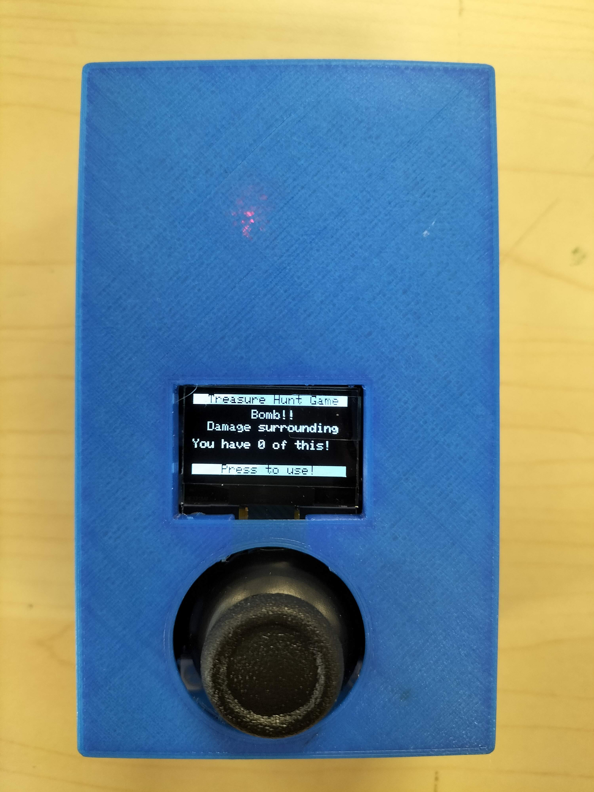

# ENITIO 2022 WANDERer Programming Project

Treasure Hunt tech game developed by Tech Team of ENITIO 2022, School of Electrical & Electronic Engineering, Nanyang Technological University, Singapore.

The repository includes C++ codes for different ESP32 modules (players, treasures & healing stations) and Python codes for the web server.

## Credit
Tran Anh Quan

Ming Yuan

Chan Kah Leong

Shirsho Sinha

Siddhangana Sinha

Yan Sheng

Edmund Ang

Yash Sinha

## Gallery

